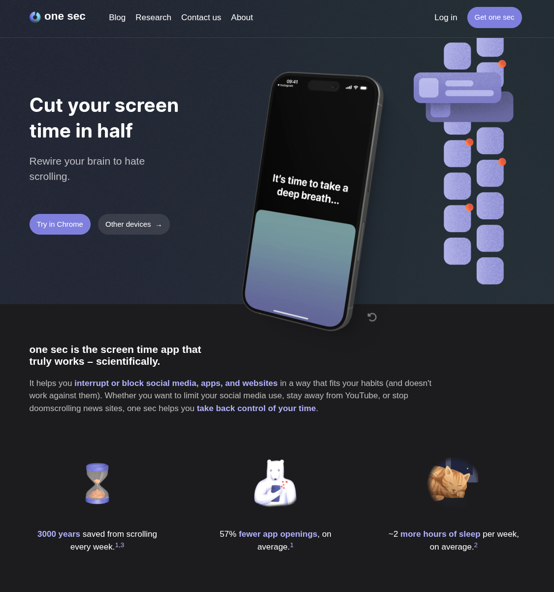
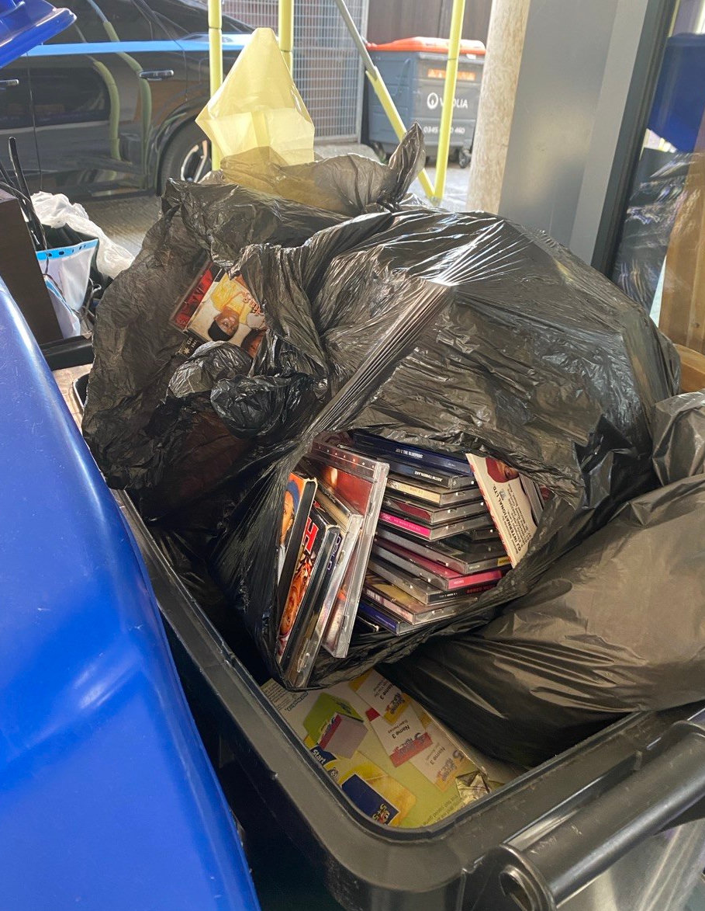
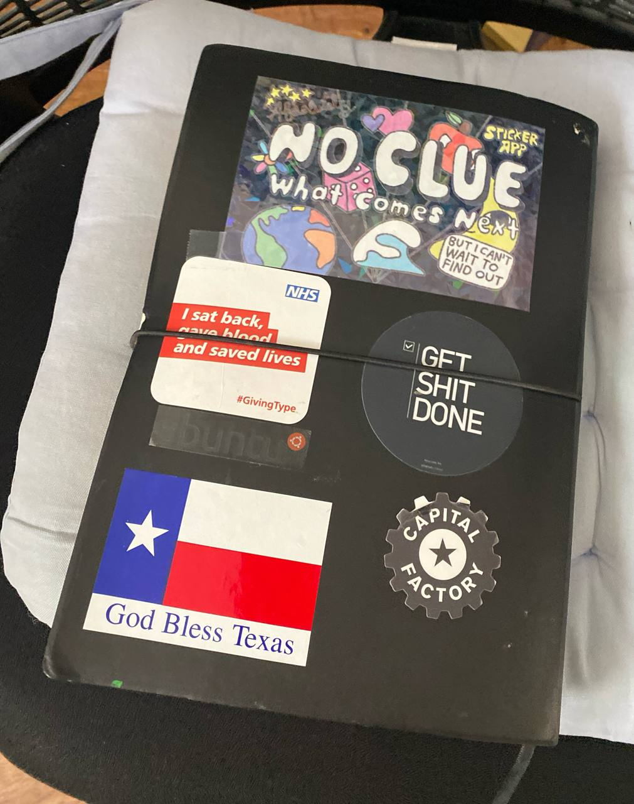

# My Decluttering Method

I got recently into more conscious decluttering although I was practicing it a bit in the past. This is my journey and some of my tactics.

## Why Do It in the First Place

Most of the cluttering in my life exists as promises given, deals made, needs, activities of my **former self** or with **people not anymore in my life or have changed considerably**. Keeping these things either in the physical, home or my parents' home, or in the digital space creates a sense emotional loss or time-travels to a person who is no longer me or to people no longer there or who have moved on to something completely different.

Allow a few examples: a cousin of mine moved out of London a couple of years ago and left us her TV set which had an embedded DVD player. This because we had some kid's DVDs. Now 7/8 years later, nobody was watched a DVD for the last 5 years, and if she ever visits - improbable - I doubt that a part of her will say to us *where is that TV set?* or even that she remembers the fact to be honest. With that in mind 5 years late, that TV set is on the area where we put stuff for the local recycling facility. This would have happened years ago (!) but there was another item I had not thrown away up front covering it. If you ever had experiences like this, keep reading.

Another example: Yesterday I wanted to find an email on which I had to act on. I had to scroll down to pass on some updates on Job postings with companies hiring. Now I really do not see myself looking for a position soonish, unless my manager finds out I am typing these lines while I wait for the test suite to pass, which means that that update should not be there, either for me to read it or to re-read it while scrolling. Why was it there? Because last time I was looking for positions, I let it be "just in case something goes wrong", which almost never happens. To summarize, I am spending time reading and deleting emails because my former self became unemployed. On top, some recruiters are paying, pennies though but it adds up, to reach me while I will not respond to them.

## Digital Space

### Email and Online Accounts

Decluttering almost always starts with me upon receiving an **update which is no longer relevant to me**, recently job offers. If I have about 10 minutes I decide on the following: Do I want to keep the account or to cease the communication? If I want to keep the account then I click on "Unsubscribe", if the company has more than one step to remove me, then I deliberate on marking as spam or logging in. If time allows I log in and untick everything. Then I get back to my email and remove **all** emails from that company.

More often than thought the account is no longer relevant. Something used once or a couple of times in the past, like that sticker promotion pack which I used for my podcast and now wants US tax authorization, that flower seller that I used once and will never use again as I buy local, etc. In these cases I give the extra time to remove my account. Some companies ask for a support ticket in order to convince you to stay. That's OK, can create that ticket. Again then I wait for the confirmation and then remove all the emails from that company.

### Every Now and Then Account Check

Sign Ups

### Articles to Read Later/Keep

I was using many and different applications, again causing questions like: "where should I store this?".

Having [OpenClaw](https://openclaw.ai/), I created a group chat and added the following:

> Whenever I send a link to this topic, add the link and the meta data to the Postgres database defined in memory.md

There are infinite plug-ins available for something similar with some of those using [Obsidian](https://obsidian.md/). Idea can be as simple as: get a synchronized location, drop links there. Then keep ones that matter, drop all others. Then one day when you are no longer interested on the subject, select, delete, gone!

### Facebook and other social media

#### Facebook

I was kind of early in the Social Media space, long story with my Facebook account dating back to 2007. It kind of exploded in the 2010s and now I use it mostly to communicate with some people and participate in some groups.

Problem statement:

- Too stuff much public, some of it not me any more
- Too many groups that I signed because a friend had started them and no longer relevant
- Added friends from University or high school with no interaction for 10+ years. These are all great people, just not in my life really. One had post many years ago a proximity test: "*how will you feel if they, or you for them, die?*". If not devastated, maybe you have drifted apart

Solution(s):

- Created a synchronized folder, in a private git repository, can be Dropdox, Proton Drive, something
- Facebook recommends memories to revisit, I download the photo or the text then either untag me or delete the photo
- When a Facebook-friend posts a memory, I think on if we are still attached, if not I un-friend them on the spot
- Same for Groups. Idea is that if it does not post, then no harm done, if it posts it has to be relevant
- Periodically I see applications, groups, friends, photos and remove or download+remove on the spot. Usually when I have a meeting in 10 minutes or something and giving this 20/30 seconds

Idea is not to stress it, create space for new Facebook-friendships, groups, with the amount of information in this medium to be declining over time. Content should be less and less while also more relevant.

#### Instagram

Was never using the platform too much. Had caught myself in following some accounts and seeing their daily updates prompting for doom-scrolling. Here the solution was easier: I removed Instagram from my phone applications. Felt an itch for a couple of days, but that was it. Now I log in every 4/6 months for 10 minutes to see if I have missed something. I never had. I keep it because I have some people that I can reach out only from there.

#### X

Tough. This because it has content both relevant to me and also engaging/addictive. I like getting ideas from random people, seeing latest trends in vibe coding, trolling people with opposing political beliefs when bored, doing random jokes. This way I made a friend, but only one.

Solution: Downloaded an application named "[one sec](https://one-sec.app/)", not affiliated, and set it up to shield X. It takes 2 minutes now to allow you to open the application it covers/shields, which kills the random habit of checking things. It also has a pron blocker in the free version. Enabled it in phone just in case.

One Sec:

> Cut your screen time in half: Rewire your brain to hate scrolling.
>
> one sec interrupts the toxic loop of social media dopamine hits – scroll, like, repeat.

### TikTok + Newer Ones

Do not have an account. Conveniently, TikTok does not allow you to do much without an account which shielded me from engaging with the platform.

### Bookmarks and Other Links

### Your Music and Book or Other Collection

These days we generate and accumulate lots of data. Also the storage prices are low.

## Physical Space

### A Comment on the Marie Kondo Method

I find it too "pushy". In the sense that after seeing some the Netflix episodes, at the end people are asked to decide what to keep and what to drop in about 1 or 2 hours. In my case this short time frame would cause errors of judgment and drop too many or too few items in a way that people might regret it later on.

### Nobody Cares About Your Stuff

The perceived value we have assigned to physical items in reality is very lower than what we initially believe, in cases closer to zero. Once we discover this, it makes it emotionally easier to let go of items, but not easy. It is a skill to be learned and as I have seen takes time which later on pays off.

As one image, thousand words, this CD collection is from a bin of a charity shop AKA it did not stand the test of someone taking it for 10p per piece:

There are many people who have shared their stories, after listening to them on YouTube I discovered that their stories were kind of similar to mine. Because of this instead of providing some links, I will share my own experiences. The pattern though is roughly that us or our parents/grandparents accumulated stuff either as a hobby or because they believed it was a future investment. What happened at the end was with even the people gone, these items occupy physical and mental space either on the people left behind or to our current self if it was us. Letting them go is hard as every time we touch them, memories come in, or the mind plays a trick on their actual value. Once we conquer this, we can start acting on it.

#### Personal Experiences

I quite recently discovered Vinted.com, again not affiliated. I had sold some items on eBay in the past but this platform was very hands-on on liquidity. I tried to sell a t-shirt of a band I no longer support and instead of promoting it to "gym t-shirt" kept clean in my wardrobe. Someone bought it on the spot asking for a discount. As he told me, he had that same t-shirt and lost it. After that I felt a strange feeling. A part of my head was being freed as the "what will I do with this thing" question got answered: nothing as it is now gone! Then I had that tarot deck that I had purchased in a festival in Athens and kind of kept it to remind me of the period. But have other connections to that period, drop it for sale, a person with an avatar pointing to new-age stuff bought it and again, out of my brain until I decided to write this experience. From that moment on whenever I opened that drawer, I had **5 more seconds of life** as I was not thinking of what should be done with it. For the curious, with the money got, I purchased a video game in that platform which I was chasing. Then something strange happened.

I started putting some books or graphic novels, and... nobody cared or even worse was getting offers for a tiny amount of money like £1 with which I'd rather leave them outside of my door for a stranger to pick up. This is where I came across the first rule of decluttering:

> Nobody cares about your stuff

or that if I could phrase it in another way - before elaborating more: The price of a used item without utility value is closer to zero than you think if it is yours, specially for books.

More details about it in the next section.

Another one which runs deep in emotion follows. My father died a couple of years ago, we gave away medical equipment he was using, clothing, other stuff. This left lots of space in the house. Because there was the discussion of relocating my mother living there, we took things out of lofts and other locations and placed them in libraries, etc to see what we should keep or not. When I saw items from my childhood, early adulthood, and other times in front of me, I felt something like a nostalgic sinking sand sucking wrap engulfing me. I remember exactly thinking "this is amazing, I can come here and spend all my time being among these things, reading the books, touching the toys, looking at the items". It felt like that. Like I could go back to Athens and instead of seeing friends, playing with my child, doing things, would go to a museum of the past. This was the tipping point, where my decluttering became more aggressive. 

There were for example some young adult books that I had read around 10. Well, Waterstones has millions of these, and no modern kid would be interested in those stories. As they fulfilled their purpose, they can go to the document shredder I had bought and live again as a new book or notepad down the line. That book that that teacher in primary school who also did not like me at all had said that "every child should read", and my parents bought it for me because I had to read it. OK, amazing literature, but associated with a trauma... gone. I took out about 10% of these items that day that I had that thought. I did not want to over-do it as I might destroy something I should not. At that point since there were no other items hidden, I had everything in front of me. From that point I give away or donate or recycle a small amount of items on each trip. Less emotional burden - few things at a time, not much time - one hour on every trip, and their number goes down steadily freeing me in the process.

#### Some Numbers

One reason for this is that we all kind of "compete" with Amazon or other similar retailers. Say I got a paperback for £9.99, round it to £10. If I want to sell it to someone then the transport costs are at least £2.80, let's say £3 again for ease of comprehension. This means that I need to sell it for **at most** £7 to have the same price as Amazon. But why would one trust a random person on the Internet and a company such as InPost without as amazing logistics which will give them the same thing that Amazon can give with the same amount of money the next day guaranteed, assuming  a Prime subscription? Even if people do not have prime, math is quite similar. Which means that in order to make sense for a person who does not know me, the same book should be either sold for £3 to £4 to have the risk make sense, unless it is a special edition. If it is a bit torn even less, etc.

The only items where I see differences are collectibles, electronics, tools or items with high utility value. My findings:

Collectibles: Baseball cards, Pokemon cards, etc. Varies based on general economy. Also, can drop in value hugely it the culture currents change... and raise sharply if the opposite happens. Can think of items rising in value like vinyl records, but would you rather wait forever? Plus not for all bands/genres.

To get an idea, first article in https://search.brave.com when I looked is <https://www.businessinsider.com/collectibles-collectors-items-worthless-not-valuable-today#recent-comic-books-arent-as-valuable-as-older-ones-7>

All 20 items: "Norman Rockwell collector plates", "Model train sets", "New baseball cards", "Ceramic or porcelain dolls", "Pogs from the '90s", "Recent comic books", "Royal family memorabilia", ""Star Wars" toys (later action figures)", "Most vinyl records", "Barbie dolls", "Antique "silver" serving plates", "Pez dispensers", "Stamps", "Vintage band T-shirts", "Funko Pop! figurines", "Most vintage Playboy magazines", "Most Beanie Babies", "Pandora charms", "Precious Moments figurines", "Vintage college swag".

I had been collecting metal records in the 90s. The clever sellers were telling us that you could sell them for a higher price, and it was right for about 5 to 10 years. Then nobody would be interested into purchasing a "mayhemic riot" vinyl. What ended up happening was to put like 80% of them in a bag and give them to a friend who collects all music from 70s to today.

This is completely different than art items which is a different investing instrument if you want to see it this way.

Electronics: Have intrinsic and utility value, and some of them can be recycled, which allows then not to completely zero.

## My Method for Physical Items

This is what I came up with after some years of tinkering. I do not believe that the cut-off approach that I see in places works for everybody. Usually it is something in the lines of "prepare yourself, dedicate a morning or an afternoon, see the things, decide on the spot, donate/burn/thrash what you will not use again". I find it stressful, asking for too many things to happen at once and possibly traumatic.

I would like to suggest a more step-by-step, easier to implement method inspired from the ageless book "Getting Things Done".

### Space Division and Management

Define a space on which you will place the items that you are considering to keep or dispose. As we tend to stack items on top of one another, this space is divided into visible and not visible items. There can be places that are not in that space like storage boxes, actual storage, lofts, garages, etc.

When you have time or take a break from something else visit that space. You need to be prepared to assess **at least one item** from there.

Pick up an item. If you want it in your life, take it away and place it where it will from now on "live".

If that is to go, choose if you want to give it to someone else. If so call them or text them. If they do not want it OK. If they do send it to them. This is the magic spot. Unless you schedule to see each other soon, do not leave it for later. It is best to pay a little bit for postage and finish with this whole item space earlier over anything else. If nobody wants it then decide on charity/recycling/thrashing. Execute.

You need to process at least one item per visit. Once you decide then as space clears more items not visible become visible to be processed on the same visit or in the future. The moment a tiny bit of space opens up, cover it with items that are not there yet: open a box, empty a storage locker, etc. This way you claim more space for your now-life or you pay less for storage.

If there are many similar items, batch. For my case: all comic books of a specific genre given to one person.

The idea is to have everything that needs decluttering in one place and establish a process where as time goes by, at least one thing gets processed. It is easier to give that time in installments over one and go. I have it in the same mind as paying a mortgage over buying a house full price. Yes I will pay interest, yes it will take long, but I do not need to come up with the capital, here emotional capital, up front.

In my case, I had an area with stacked boxes. On every visit, I was emptying one. Once that got empty, I found other items around the house, filled the box and placed it on the bottom. Then opened the next one.

## Physical to Digital/Smaller Physical

One way to reduce the physical output of items is to take them from physical to digital space: atoms to bits.

#### Memory Book

At one point in time purchased an A4 notepad for drawing. Every time I want to keep a brochure, something that I like, a sticker, or as I say a memory, I glue/cello-tape it there. This specific one is being used for about **5 years**.

The benefit of this is that it consumes very  little space, The fact that I need to get glue or cello-tape helps me to ask if I really want to keep that paper item forever.

#### Scanning and Screenshots

Since there are many scanner applications which use the cameras of our mobile phones, papers that we do not know if will not be used in the future can be scanned and stored digitally - or Screenshoted. I purchased a document shredder and honestly shredded it's volume in old papers in the first couple of weeks.

I also have  a printer/scanner which can produce scans with very high resolutions.

## How Not to Accumulate Things in the First Place

For you towards yourself, the best way not to need to declutter is not to buy an item in the first place. The second best is to have a schedule to use it and then give it away. This because it is always difficult to let go something that we have been emotionally invested in. There are also the so called "hype" purchases: a author you like releases a new book, should you buy it as hardcover, wait for paperback or not at all? Would you rather read it from the library? Is he one of the people who write these shallow 300 pages books that you know what they are talking about after you listen to 4/5 interviews of them?

OR ??

For items not inherited to you, but purchased from you, the best option is not to purchase them in the first place, with a small footnote on books to discuss later. If purchased a good idea is to have a schedule or better a "promise" to dispose them in the future, say if not used for X months or years. 

### The Lists Approach

